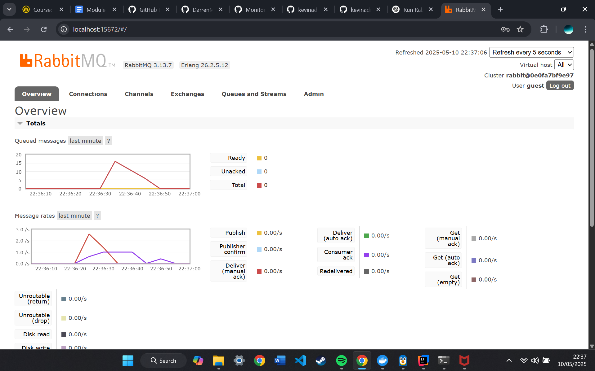
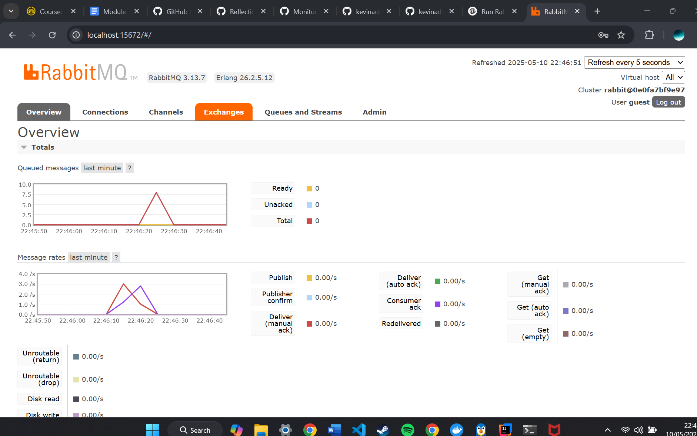
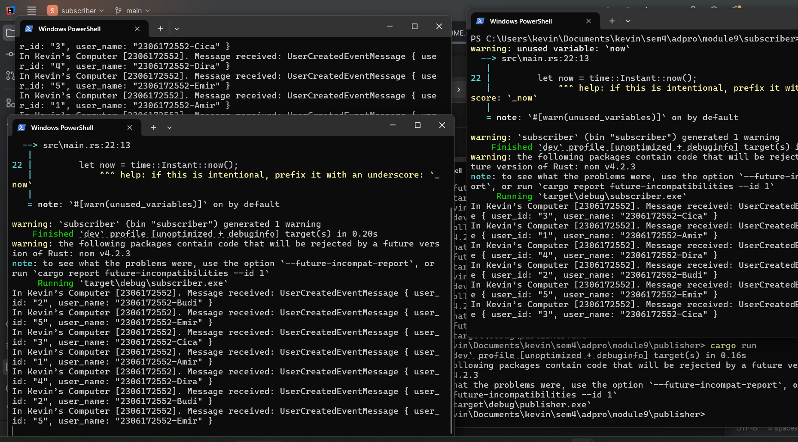

What is amqp?
AMQP stands for Advanced Message Queuing Protocol. It is a standardized protocol used for sending and receiving messages between distributed systems. AMQP enables reliable, asynchronous communication between services or applications, making it useful for building scalable systems. It supports features like message queuing, delivery guarantees, and routing. AMQP is commonly used with message brokers like RabbitMQ. This protocol helps decouple services so they can operate independently without waiting on each other.

What does it mean? guest:guest@localhost:5672 , what is the first guest, and what is the second guest, and what is localhost:5672 is for?
guest:guest@localhost:5672 = This is a connection URL to an AMQP broker (usually RabbitMQ).
The first guest is the username.
The second guest is the password.
These are the default credentials for RabbitMQ when running locally.
localhost → The broker is running on your local machine.
5672 → The default port RabbitMQ uses for AMQP connections.
this string tells the client to connect to a RabbitMQ server on the same machine using the guest user credentials over port 5672.

## Simulation slow subscriber

When I ran the publisher program, it sent 16 messages to RabbitMQ. This number appeared in the "Queued messages" chart under the "Total" line, indicating that 16 messages were waiting to be consumed. The spike happened because either the consumer wasn't running immediately or was slower than the publisher. After some time, all the messages were successfully acknowledged and consumed, so the total dropped back to 0. This shows that the messaging system is working as expected — messages are queued and then processed. The number may differ on other machines depending on how fast the consumer starts or how many messages the publisher sends.

## Reflection and Running at least three subscribers

When only one subscriber is running, all messages are processed sequentially, causing the queue to grow temporarily. By running multiple subscriber instances, RabbitMQ can distribute messages among them. This reduces processing time and shortens the spike on the queue graph. Each subscriber pulls messages from the same queue, allowing parallel handling. This behavior is a core strength of event-driven systems, enabling horizontal scalability. The faster drop in message backlog shows that the system becomes more responsive as subscribers increase.